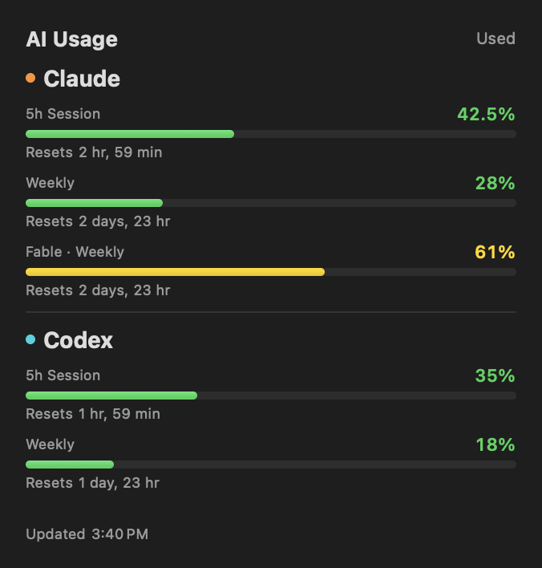

# ClaudeUsageWidget

macOS 桌面小组件（WidgetKit），同时监控你的 Claude、Claude Fable 和 Codex 订阅用量。


[English](README.md)


## 截图



*预览使用演示数据。*

## 功能

- **5 小时会话用量** + 进度条
- **每周用量** + 进度条
- **Fable 独立周额度** + 重置时间
- **Codex 用量** 自动读取本机 ChatGPT 登录，按实际窗口显示
- **应用内仪表板** 手动刷新、分别开关 Claude / Codex
- **重置倒计时**
- **颜色随用量变化** 绿 → 黄 → 橙 → 红
- **三种尺寸** small、medium、large
- **双重认证** OAuth token 或 session key
- **自动刷新** 每 5 分钟请求更新，实际调度由 macOS 决定
- **原创应用图标** 随项目按 MIT 许可提供，无第三方图标素材

---

## 用 Claude Code 快速安装

把下面这段话粘贴给你的 Claude Code：

```
帮我克隆并构建 ClaudeUsageWidget 桌面小组件。

步骤：
1. git clone https://github.com/dependentsign/ClaudeUsageWidget.git ~/Documents/ClaudeUsageWidget
2. 构建并打包：cd ~/Documents/ClaudeUsageWidget && ./scripts/build-local.sh
3. 解压 build/ClaudeUsageWidget-1.1.zip，退出旧应用后将 ClaudeUsageWidget.app 复制到 /Applications
4. 打开应用，在配置界面填写我的 Claude OAuth token，或 session key 和组织 UUID；已有配置直接沿用
5. Codex 使用 ChatGPT 登录后，应用默认自动读取 ~/.codex/auth.json
6. 点击 Save & Refresh
7. 告诉我右键桌面 → 编辑小组件 → 搜索 "Claude" 或 "Codex" 添加
```

---

## 手动安装

也可从 [Releases](https://github.com/dependentsign/ClaudeUsageWidget/releases/latest) 下载应用压缩包。退出旧应用后解压并替换 `/Applications/ClaudeUsageWidget.app`。发布包同时支持 Apple Silicon 和 Intel，使用本机临时签名，未经 Apple 公证。

### 1. 构建

```bash
git clone https://github.com/dependentsign/ClaudeUsageWidget.git
cd ClaudeUsageWidget
open ClaudeUsageWidget.xcodeproj
```

在 Xcode 中：
- 在两个 target（ClaudeUsageWidget + ClaudeUsageWidgetExtension）中选择你的**开发者团队**
- 按需修改 **Bundle Identifier**
- 构建运行（⌘R）

也可运行 `./scripts/build-local.sh`，生成 `build/ClaudeUsageWidget-1.1.zip`。脚本在临时目录编译，避免 Documents/iCloud 的扩展属性导致签名失败。

### 2. 配置凭证

打开应用填写并保存，或创建配置文件 `~/.claude/claude-usage-widget.json`。Fable 沿用 Claude 凭证，无需单独设置：

**方式 A：OAuth Token（推荐）**
```json
{
  "oauthToken": "你的-oauth-bearer-token"
}
```

**方式 B：Session Key**
```json
{
  "sessionKey": "sk-ant-sid01-...",
  "organizationId": "你的-org-uuid"
}
```

<details>
<summary>如何获取 session key</summary>

1. 打开 [claude.ai](https://claude.ai) 并登录
2. 开发者工具（F12）→ Application → Cookies → 复制 `sessionKey`
3. 获取组织 ID：
```bash
curl -s https://claude.ai/api/organizations \
  -H "Cookie: sessionKey=你的KEY" | python3 -m json.tool
```
选择你正在使用的订阅组织，复制它的 **`uuid`** 字段，不是数字 `id` 或 `parent_organization_uuid`。

</details>

**Codex（默认自动读取）**

使用 Codex CLI 的 ChatGPT 账号登录后，每次刷新自动读取 `~/.codex/auth.json`，可跟随凭证轮换。API key 不提供订阅额度。

若登录仅在钥匙串、自定义 `CODEX_HOME` 或其他位置，可在应用的 **Manual token** 填写 access token 和可选的 ChatGPT account ID。手动 token 优先于自动读取，过期需更新；清空后恢复自动读取。应用不刷新或修改 Codex 登录文件，自动凭证过期时请在 Codex 重新登录。

```json
{
  "codexEnabled": true,
  "codexAccessToken": "你的-codex-access-token",
  "codexAccountId": "你的-chatgpt-account-id"
}
```

原配置兼容；`claudeEnabled` / `codexEnabled` 可分别开关提供方。保存时保留未知字段、原子写入，并设置文件权限为 `0600`。

### 3. 添加小组件

1. 右键桌面 → **编辑小组件**
2. 搜索 **"Claude"** 或 **"Codex"**
3. 选择尺寸并添加

---

## 工作原理

小组件分别调用两家的用量接口：

| 方式 | 接口 |
|------|------|
| OAuth | `GET https://api.anthropic.com/api/oauth/usage` |
| Session Key | `GET https://claude.ai/api/organizations/{orgId}/usage` |
| Codex | `GET https://chatgpt.com/backend-api/wham/usage` |

返回数据：
- `five_hour.utilization` — 5 小时窗口用量百分比
- `five_hour.resets_at` — 重置时间戳
- `seven_day.utilization` — 每周用量百分比
- `seven_day.resets_at` — 每周重置时间戳
- Fable：优先读取 `limits[]` 中 `weekly_scoped` 的 Fable 模型额度，兼容 `seven_day_overage_included` / `seven_day_fable`
- Codex：读取 `rate_limit.primary_window` / `secondary_window` 的 `used_percent`、`limit_window_seconds`、`reset_at`

百分比表示**已用**额度。缺失数据显示 `—`，不当作 0%；不自行按 50% 换算 Fable 额度。Codex 展示通用订阅额度，不汇总 Spark 等附加额度或 API 账单。

两家请求并发执行、错误独立展示。401 提示更新凭证，403 提示检查登录及访问权限，429 提示等待下一次刷新。中、大尺寸显示重置时间，大尺寸显示更新时间。订阅用量接口可能变化。

---

## 二次开发

### 项目结构

```
ClaudeUsageWidget/
├── ClaudeUsageWidget/                    # 宿主应用（仪表板 + 配置）
├── ClaudeUsageWidgetExtension/           # WidgetKit 时间线和入口
├── Shared/                              # 共用数据模型、请求和视图
├── Tests/UsageCoreTests/                 # 回归测试
├── scripts/                             # 构建、预览、图标生成和接口检查
├── artwork/                             # 原创图标 SVG 和许可说明
└── screenshots/
```

> **注意：** 小组件扩展运行在 App Sandbox 中。代码使用 `getpwuid(getuid())` 获取真实 home 目录路径，因为 `FileManager.default.homeDirectoryForCurrentUser` 在沙盒中返回的是容器路径。

### 验证

```bash
swift test
./scripts/build-local.sh

# 生成三种尺寸、深浅色、正常/失败/缺失数据的 18 张 SwiftUI 预览
mkdir -p build
swiftc Shared/UsageModels.swift Shared/UsageViews.swift scripts/RenderPreviews.swift -o build/render-previews
build/render-previews
```

`CheckLiveUsage.swift` 可选用本机凭证进行只读检查，仅输出用量和错误。图标由 `GenerateAppIcon.swift` 生成，来源与许可见 [artwork](artwork/README.md)。

## 系统要求

- macOS 15.0+
- Xcode 16.0+
- 要显示 Claude：有相应用量额度的 Claude 订阅
- 要显示 Codex：Codex 的 ChatGPT 账号登录

## 许可

MIT — 详见 [LICENSE](LICENSE)
